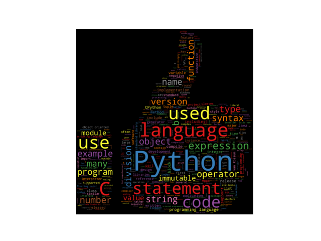

# Word Cloud Generator
Python program to generate word cloud.

#### Cloning the repository
`git clone `

#### Installing Requirements
```Bash
cd 
pip3 install -r requirements.txt
```

#### Usage
```Bash
chmod +x wordcloudgen.py

./wordcloudgen.py -f <filename> [options]

Options:
  -i, image render for custom shapes.
  -cm, color for colormap, for more colors refer the link below
      https://matplotlib.org/3.1.0/tutorials/colors/colormaps.html
  -bg, background color for the word cloud.
  -wd, width of the word cloud.
  -ht, height of the word cloud.
```

##### Example
```Bash
./wordcloudgen.py -f python_wiki.txt -i hand.png -cm Set1 -bg 'black' -wd 1000 -ht 800


 __          __           _    _____ _                 _ 
 \ \        / /          | |  / ____| |               | |
  \ \  /\  / /__  _ __ __| | | |    | | ___  _   _  __| |
   \ \/  \/ / _ \| '__/ _` | | |    | |/ _ \| | | |/ _` |
    \  /\  / (_) | | | (_| | | |____| | (_) | |_| | (_| |
     \/  \/ \___/|_|  \__,_|  \_____|_|\___/ \__,_|\__,_|
                                                         
                                                         


```
<p align="center">
  
</p>
